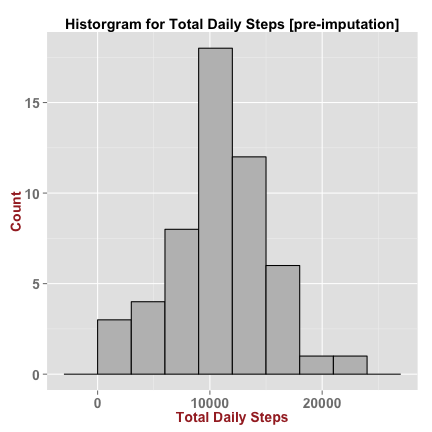
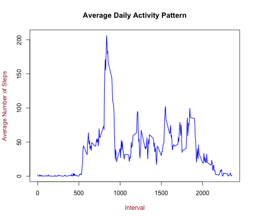
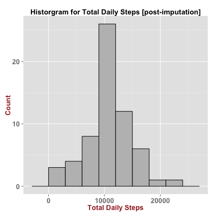
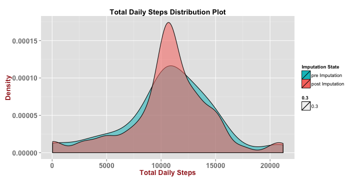
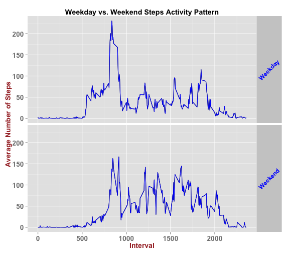

Reproducible Research: Peer Assessment 1 
========================================================

### Analysis of Human Motion Data  

The following report shall provide a detailed description of how the data was read,cleaned and analyzed to answer questions in the assignment.

### Loading the required libraries

Make sure that the following packages used by this script are installed


```r
library("timeDate") # Required for weekday calculations
library("ggplot2") # Required for plotting
library("psych") # Required for summary statistics
```

* * *

## [ Loading and preprocessing the data ]

* * *

### 1. Reading the raw CSV formatted source data file


```r
activityMonitorDataRaw <- read.csv("activity.csv",sep=",",header=TRUE,colClasses=c("numeric","Date","numeric"))
```

### 2. Tidying up the data prior to analysis 

The raw data has missing values (NA) and these need to be excluded from analysis for this part of the assignment. The interval column was renamed for additional clarity.


```r
activityMonitorData <- na.omit(activityMonitorDataRaw)
colnames(activityMonitorData) <- c("steps","date","intervalID")
```

* * *

## [ What is mean total number of steps taken per day ? ]

* * *

### 1. Creating a histogram of the total number of steps taken each day

Creating the histogram requires aggregation of steps data by date and summation of values for each group.


```r
#aggregate
activityDataTotalsByDate <- aggregate(steps ~ date,data=activityMonitorData,sum)

#plot
p <- ggplot(activityDataTotalsByDate, aes(x=steps)) 
p <- p + geom_histogram(binwidth=3000, colour="black",fill="gray")
p <- p + xlab("Total Daily Steps") + ylab("Count")
p <- p + ggtitle("Historgram for Total Daily Steps [pre-imputation]")
p <- p  + theme(axis.title=element_text(face="bold",size="14",color="brown"),
                axis.text=element_text(size=14,face="bold")) 
p <- p + theme(plot.title = element_text(lineheight=.8, face="bold"))
print(p)
```

 

### 2. Calculating and reporting the mean and median total number of steps taken per day


```r
activityTotalMean <- mean(activityDataTotalsByDate$steps)
activityTotalMedian <- median(activityDataTotalsByDate$steps)
paste("Mean Total Steps per day :", round(activityTotalMean,2))
paste("Median Total Steps per day :", round(activityTotalMedian,2))
```

```
## [1] "Mean Total Steps per day : 10766.19"
```

```
## [1] "Median Total Steps per day : 10765"
```


* * *

## [ What is the average daily activity pattern ? ]

* * *

### 1. Creating a time series plot of the 5-minute interval and the average number of steps taken, averaged across all days

Generating this plot requires the aggregation of steps data by interval, calculation of the mean values for each interval and a sort of the resulting data set in an ascending order, sorted by the interval ID.  


```r
#aggregate
activityMonitorDataByInterval <- aggregate(steps ~ intervalID,data=activityMonitorData,mean)
#sort
activityMonitorDataByInterval <- activityDataIntervalDf[order(activityMonitorDataByInterval$intervalID),]
```

```
## Error: object 'activityDataIntervalDf' not found
```

```r
#plot
plot(activityMonitorDataByInterval$intervalID,activityMonitorDataByInterval$steps,
     xlab="Interval",ylab="Average Number of Steps",
     main= "Average Daily Activity Pattern",
     type="l",col.lab="brown",col="blue",lwd=1.5)
```

 

### 2. Finding the interval that on average across all the days in the dataset, contains the maximum number of steps


```r
maxIntervalID <- activityMonitorDataByInterval[which(activityMonitorDataByInterval$steps == max(activityMonitorDataByInterval$steps)),1]
paste("Interval with the Maximum Steps :", maxIntervalID )
```

```
## [1] "Interval with the Maximum Steps : 835"
```

* * *

## [ Imputing Missing Values ]

* * *

Following computations and analysis will use an ***imputed data set*** where the missing values will be replaced with valid values.

### 1. Determining the number of records/cases in the raw data set that are missing values (coded as NA).


```r
countNARows <- nrow(activityMonitorDataRaw[!complete.cases(activityMonitorDataRaw),])
```

```
## [1] "Total number of NA records : 2304"
```

### 2. Devising a strategy for filling in all of the missing values in the dataset.

The strategy used for imputing data was to ***replace the missing data with the mean number of steps for the same 5-min interval,averaged across all days.*** 


```r
# create a data frame with all incomplete cases
missingActivityMonitorData <- activityMonitorDataRaw[is.na(activityMonitorDataRaw$steps),]
colnames(missingActivityMonitorData) <- c("steps","date","intervalID")

# Merge the incomplete data set with the previously computed activty mean data set on the interval to create a data subset with imputed values. 
imputedActivityMonitorSubset <- merge(missingActivityMonitorData,activityMonitorDataByInterval,by=c("intervalID"))[,c(4,3,1)]
colnames(imputedActivityMonitorSubset) <- c("steps","date","intervalID")
```

### 3. Creating a new dataset that is equal to the original dataset but with the missing data filled in.

Combine (rbind) the imputed data set with the data subset that had the NA cases removed, to create a new, complete data set with imputed data values


```r
#combine data frames to create a complete data set
imputedActivityMonitorData <- rbind(activityMonitorData,imputedActivityMonitorSubset)
```

### 4.1 Plotting a histogram of the total number of steps taken each day and calculating and reporting the mean and median total number of steps taken per day. 

Creating the histogram requires aggregation of steps data by date and summation of values for each group. 


```r
# aggregate
imputedActivityDataTotalsByDate <- aggregate(steps ~ date,data=imputedActivityMonitorData,sum)

# plot
p <- ggplot(imputedActivityDataTotalsByDate, aes(x=steps)) 
p <- p + geom_histogram(binwidth=3000, colour="black",fill="gray")
p <- p + xlab("Total Daily Steps") + ylab("Count")
p <- p + ggtitle("Historgram for Total Daily Steps [post-imputation]")
p <- p  + theme(axis.title=element_text(face="bold",size="14",color="brown"),
                axis.text=element_text(size=14,face="bold")) 
p <- p + theme(plot.title = element_text(lineheight=.8, face="bold"))
print(p)
```

 

```r
# computing the mean and median for the total daily steps 
imputedActivityTotalMean <- mean(imputedActivityDataTotalsByDate$steps)
imputedActivityTotalMedian <- median(imputedActivityDataTotalsByDate$steps)
```

```
## [1] "Imputed data Mean total Steps taken per day : 10766.19"
```

```
## [1] "Imputed data Median total Steps taken per day : 10766.19"
```

### 4.2 Comparing the mean and median estimates for data sets with and without the missing data imputed and analyzing the impact of imputing missing data on the estimates of the total daily number of steps

Some basic column-level descriptive statistical measures can be compared with the describe() function in the psych package


```r
 d1 <- describe(activityDataTotalsByDate$steps)[c(-1,-6,-7)]
 d2 <- describe(imputedActivityDataTotalsByDate$steps)[c(-1,-6,-7)]
```

Descriptive statistics for data set WITHOUT missing values imputed (some measures were supressed)


```
##    n  mean   sd median min   max range skew kurtosis    se
## 1 53 10766 4269  10765  41 21194 21153 -0.3     0.59 586.4
```

Descriptive statistics for data set WITH missing values imputed (some measures were supressed)

```
##    n  mean   sd median min   max range  skew kurtosis    se
## 1 61 10766 3974  10766  41 21194 21153 -0.32     1.15 508.9
```

Following observations can be made from the comparison of the descrptive statistics for the two data sets
* * *

* No change in Mean values 
* Minimal change in Median values
* The variance and standard deviation of the data reduced for the data set with imputed values
* The quartile cut-offs slightly shifted to the right following imputation (indicated by base summary function)
* Additional Density plots confirmed the skewness and kurtosis statistics reported by the describe function (shown below) 


```r
p <- ggplot() 
p <- p + scale_fill_discrete(name="Imputation State") + guides(fill = guide_legend(reverse=TRUE))
p <- p + geom_density(aes(x=steps,fill=as.factor("pre Imputation"),alpha=0.3), data=activityDataTotalsByDate) 
p <- p + geom_density(aes(x=steps,fill=as.factor("post Imputation"), alpha=0.3), data=imputedActivityDataTotalsByDate)
p <- p + xlab("Total Daily Steps") + ylab("Density")
p <- p + ggtitle("Total Daily Steps Distribution Plot")
p <- p  + theme(axis.title=element_text(face="bold",size="14",color="brown"),
                axis.text=element_text(size=14,face="bold")) 
p <- p + theme(plot.title = element_text(lineheight=.8, face="bold"))
print(p)
```

 

* * *

***The impact of replacing missing data with imputed values is negligble or very low - the chosen data imputation strategy is acceptable for generating a data set that will be used performing simple summary computations ***  

* * *

## [ Are there differences in activity patterns between weekdays and weekends ? ]

* * *

Continuing to work with the complete and imputed data set for analyzing weekday and weekend activity patterns in the data

### 1. Creating a new factor variable in the dataset with two levels -- "weekday" and "weekend" indicating whether a given date is a weekday or weekend day.

A new factor variable 'day' is added to the data set and is assigned a value based on the date of the obervation


```r
imputedActivityMonitorData$day <- sapply(imputedActivityMonitorData$date,FUN=function(x) { if(isWeekday(x)) {as.factor("Weekday") } else {as.factor("Weekend")}})
```

### 2. Making a panel plot containing a time series plot of the 5-minute interval and the average number of steps taken, averaged across all weekday days or weekend days.

Generating the panel plot involves aggregation of data by the interval and the new factor variable 'day', followed by computation of the mean number of steps for each (interval + day) group


```r
# aggregate 
imputedActivityDataByIntervalDay <- aggregate(steps ~ intervalID + day,data=imputedActivityMonitorData,mean)

#plot 
p <- qplot(x=intervalID,y=steps,data=imputedActivityDataByIntervalDay,geom="line",facets=day~.)
p <- p + geom_line(col="blue", width=0.6) 
p <- p + xlab("Interval") + ylab("Average Number of Steps")
p <- p + ggtitle("Weekday vs. Weekend Steps Activity Pattern")
p <- p  + theme(axis.title=element_text(face="bold",size="14",color="brown"),
                axis.text=element_text(size=14,face="bold")) 
p <- p + theme(plot.title = element_text(lineheight=.8, face="bold"))
p <- p + theme(strip.text.y = element_text(colour = "blue", angle = 45, size = 12, face="bold",
                hjust = 0.5, vjust = 0.5))
print(p)
```

 

***Activity for weekends appears to be more spread out compared to that during weekdays. Weekday activity pattern shows high peaks during early intervals followed by an extended period of low activity. Weekend activity profile indicates a delayed start but maintains a medium level of step activity through out the day.*** 


* * *
